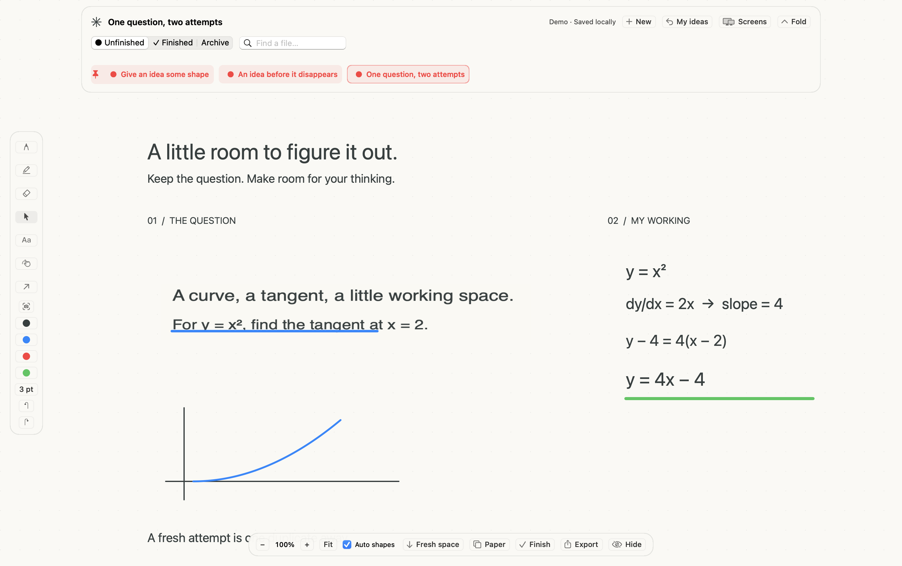
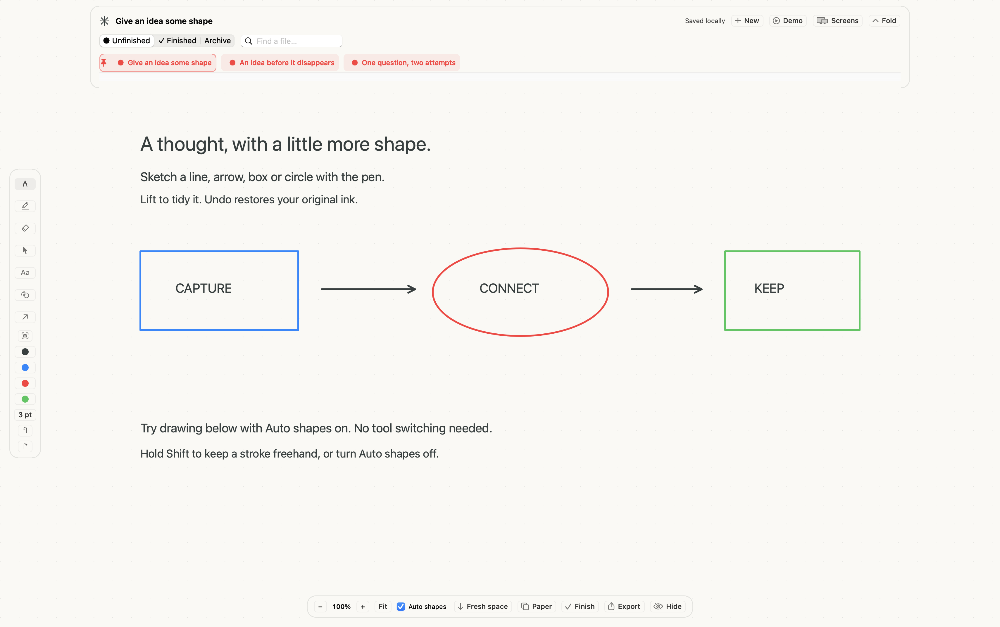

# Try Whiteboard

**[Download the Mac app](https://github.com/zakimaths/whiteboard/releases/download/v0.4.0/Whiteboard-0.4.0-macOS-arm64.zip)** · **[Download editable sample boards](https://github.com/zakimaths/whiteboard/releases/download/v0.4.0/Whiteboard-Sample-Ideas.zip)**

You can view every image on this page without installing the app or signing in. To try the actual product on an Apple silicon Mac, download the ZIP, open Whiteboard, then click **Demo** at the top. Use **My ideas** to return to your own workspace. The demo is local and editable, with no account or trial expiry. The app is an early preview and is not Apple-notarised; see the [installation notes](../README.md#open-and-use).

Demo boards live separately in `~/Library/Application Support/Whiteboard/Demo Ideas`. Changes are retained when you leave and return. The app normally relaunches into your personal library; developers can launch the executable with `--demo` to open directly in the demo.

The examples use original fictional content. The workspace images were exported by the running app itself; they are not design mockups or desktop recordings. The other PNG/PDF files are content exports from the same document renderer.

## Academic working

Click **Demo**, then **One question, two attempts**. Select the question image and drag its bottom-right handle: its annotation stays attached. Undo, or use **Edit → Fresh copy without annotations** for another attempt. Export the selection or the whole board.


## Keep the useful part of a screenshot

In **One question, two attempts**, select the question image, press **C** and drag around the question lines. Press **Return** or click **Apply crop**. Resize or move the result: attached ink stays aligned. Switch to another shelf idea and return to see the saved crop. **Edit → Restore full image** brings the original back. Escape cancels a crop before applying it.



Cropping changes the image, not separate ink. Editable boards retain the original screenshot. [Crop and export details](CROPPING.md).

To reach another app temporarily, hold **Command–Shift–Space**, interact underneath, then release to return. **Shift–Command–B** or the menu-bar Show action remains available. Physical held-key interaction across applications is still awaiting dedicated testing.

## Shapes and your shelf

Open **Give an idea some shape**. With the **Pen** and **Auto shapes** on, draw a circle, box, arrow or line below the example. Lift the pen: a confident match becomes a precise shape. Press **Undo** once to get your original handwriting back; a second Undo removes the stroke. Hold **Shift** while drawing to keep a stroke freehand, or switch **Auto shapes** off.

Explicit tools are still available: **L**, **A**, **R** and **O** for line, arrow, rectangle and ellipse. Shift constrains those tools to 45° angles or equal sides. Select and move any shape just like ink.

Control-click its shelf card → **Pin idea**. It moves ahead of unpinned ideas. **Move earlier / later** arranges cards within their pinned or unpinned group. Try **Finish**, then **Reopen**: the pin stays with the idea.



## LaTeX and TikZ

Create a fresh board. Use **File → Insert LaTeX…** and render the included quadratic-formula example. Then use **File → Insert TikZ…** for the included curve. With Select active, double-click either item to reopen its source. The screenshot below shows this interaction's saved results.


This demo requires local TeX to render new objects. [Supported input and setup](MATHS.md).

See [automatic shapes](SHAPES.md) for gesture details and the current recognition limits.

## Everyday ideas

The sample **An idea before it disappears** is an open-ended thought rather than an assignment. Add a note, hide the board, reopen it, and mark it finished. The shelf uses its actual filename and folder status.


The **Keep what worked** sample starts in Finished. Its status can be changed back to Unfinished.

## Reproducible sample files

```sh
bash scripts/make_samples.sh
```

This creates a new `build/Sample Ideas` library and PNG/PDF exports in `build/Sample Exports`. It refuses to overwrite an existing sample library. Choose the generated library through **File → Choose ideas folder…** to explore it separately from personal work.

The release also includes an editable sample-library ZIP. These four generated sample boards do not require TeX. The maths workspace demonstrates the separate source editor with its built-in examples.

The academic and maths screenshots were captured from 0.2; the shapes workspace is from 0.3; the cropped workspace is from 0.4. All are actual app view exports.
