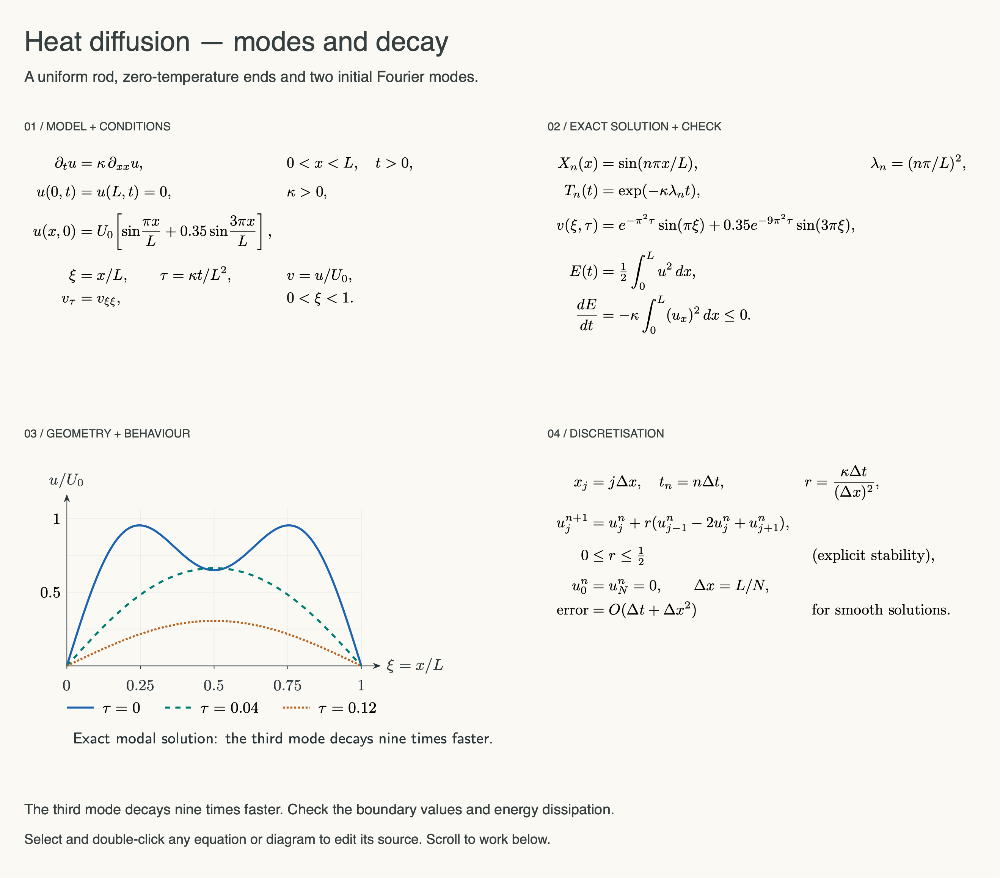
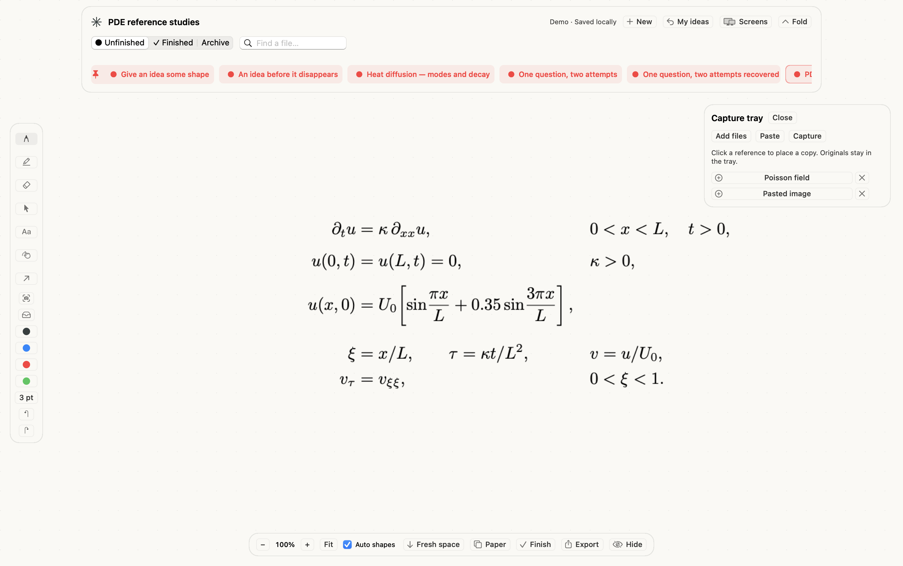

# Try Whiteboard

**[Download the Mac app](https://github.com/zakimaths/whiteboard/releases/download/v0.6.0/Whiteboard-0.6.0-macOS-arm64.zip)** · **[Download editable sample boards](https://github.com/zakimaths/whiteboard/releases/download/v0.6.0/Whiteboard-Sample-Ideas.zip)**

View the examples here without installing anything. On an Apple silicon Mac, open Whiteboard and click **Demo**. Six editable boards open in a separate local library; **My ideas** returns to your previous personal board. No account, trial expiry or TeX installation is needed to view and annotate the samples. The app is an early preview and is not Apple-notarised; see the [installation notes](../README.md#open-and-use).

Demo edits persist in `~/Library/Application Support/Whiteboard/Demo Ideas`. Existing demo libraries receive the three PDE boards once, retaining earlier examples and edits. The app normally relaunches into the personal library; developers can use `--demo` to enter the demo directly.

## Detailed academic models

Open **Heat diffusion — modes and decay**, **Wave motion — a fixed string**, or **Poisson — a field on the unit square**. Each contains a governing PDE, boundary/initial data, exact solution, energy or residual check, vector diagram and numerical scheme. Scroll to the lower sections, or use **Fit** and zoom into the part you want to study.



[Heat PDF](demos/pde-heat.pdf) · [Wave diagram and equations](demos/pde-wave.png) · [Wave PDF](demos/pde-wave.pdf) · [Poisson diagram and equations](demos/pde-poisson.png) · [Poisson PDF](demos/pde-poisson.pdf)

With **Select**, double-click any equation or diagram to reopen its LaTeX/TikZ source. Rendering an edited version requires local TeX; opening the saved examples does not. These are worked examples and exact-solution plots, not an interactive numerical solver. [Model assumptions and mathematical checks](PDE-MODELS.md).

## Collect a reference, then use it

Open the tray icon below the camera. Use **Add files** to collect saved images, **Paste** for a clipboard image, or **Capture** for a user-initiated screenshot. Try the [heat-model PNG](../Sources/WhiteboardCore/Resources/PDE/heat-model.png) and [Poisson-field PNG](../Sources/WhiteboardCore/Resources/PDE/poisson-diagram.png).

Create a fresh idea and click a tray filename to place a copy. Select it to move, resize or annotate. Removing its tray entry leaves the placed copy intact. Close and reopen the app: the board and remaining tray entries are retained.



The screen-capture permission path still needs dedicated validation. [Tray controls, storage and limits](CAPTURE-TRAY.md).

## Crop a PDE screenshot

Place the heat-model PNG from the tray, select it, press **C** and drag around the equation lines you want to keep. Press **Return** or **Apply crop**. Escape cancels. **Edit → Restore full image** brings the original screenshot back. Attached ink stays aligned when moving or resizing. Cropping works on screenshots, while the original vector maths objects remain source-editable. [Crop details](CROPPING.md).

## Return to an earlier attempt

On a PDE demo board, choose **File → Save checkpoint**, then add a line or note. Control-click its shelf card → **Recovery history…** → choose the checkpoint → **Recover as copy**. The recovered idea contains the earlier version; the original retains your later edit. [Recovery limits](RECOVERY.md).

## Shapes, shelf and everyday thoughts

Open **Give an idea some shape**. With **Pen** and **Auto shapes** on, draw a circle, box, arrow or line. A confident match snaps on pen-up; Undo brings back the original ink. Hold Shift to keep one stroke freehand. Explicit L/A/R/O tools remain available. [Gesture details](SHAPES.md).

Control-click a shelf card to pin it or move it earlier/later. Try Finish and Reopen; the pin remains attached to the idea. **An idea before it disappears** provides a general-purpose thought board, while **Keep what worked** begins in Finished.

## Reproduce the samples

```sh
bash scripts/make_samples.sh
```

This creates a fresh six-board library and PNG/PDF exports under `build`. It refuses to overwrite an existing sample library. The release's sample ZIP contains the same six generated boards, independent of personal and test-session libraries.

All current maths previews use the PDE examples. They are exports from the app's document renderer; the capture-tray image is an actual running-app view export. Earlier-release media remains in the repository history and older releases. No surrounding desktop is captured in the workspace preview.
