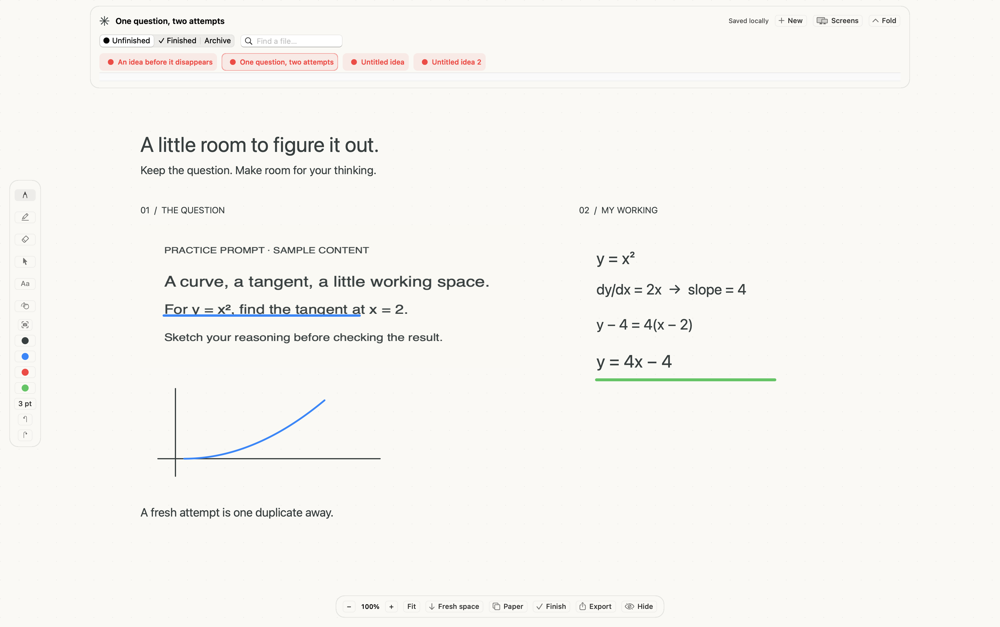
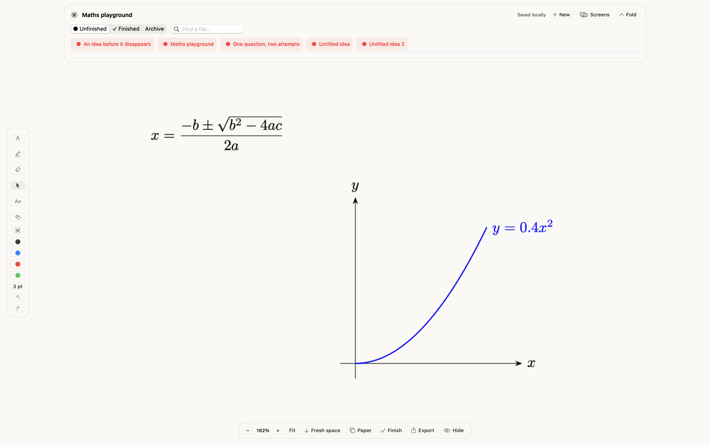
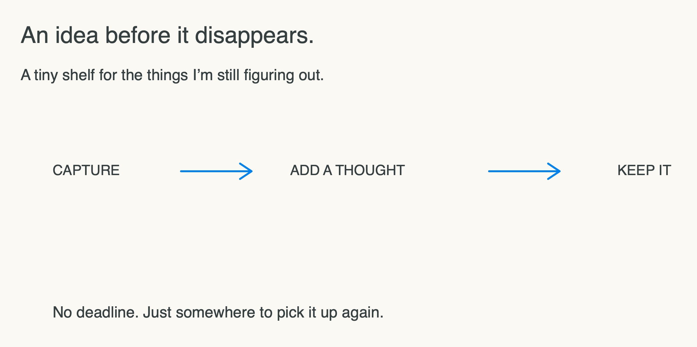

# Try Whiteboard

The examples use original fictional content. The workspace images were exported by the running app itself; they are not design mockups or desktop recordings. The other PNG/PDF files are content exports from the same document renderer.

## Academic working

Open **File → Try sample ideas**, then **One question, two attempts**. Select the question image and drag its bottom-right handle: its annotation stays attached. Undo, or use **Edit → Fresh copy without annotations** for another attempt. Export the selection or the whole board.



## LaTeX and TikZ

Create a fresh board. Use **File → Insert LaTeX…** and render the included quadratic-formula example. Then use **File → Insert TikZ…** for the included curve. With Select active, double-click either item to reopen its source. The screenshot below shows this interaction's saved results.



This demo requires local TeX to render new objects. [Supported input and setup](MATHS.md).

## Everyday ideas

The sample **An idea before it disappears** is an open-ended thought rather than an assignment. Add a note, hide the board, reopen it, and mark it finished. The shelf uses its actual filename and folder status.



The **Keep what worked** sample starts in Finished. Its status can be changed back to Unfinished.

## Reproducible sample files

```sh
bash scripts/make_samples.sh
```

This creates a new `build/Sample Ideas` library and PNG/PDF exports in `build/Sample Exports`. It refuses to overwrite an existing sample library. Choose the generated library through **File → Choose ideas folder…** to explore it separately from personal work.

The release also includes an editable sample-library ZIP. These three generated sample boards do not require TeX. The maths workspace demonstrates the separate source editor with its built-in examples.
