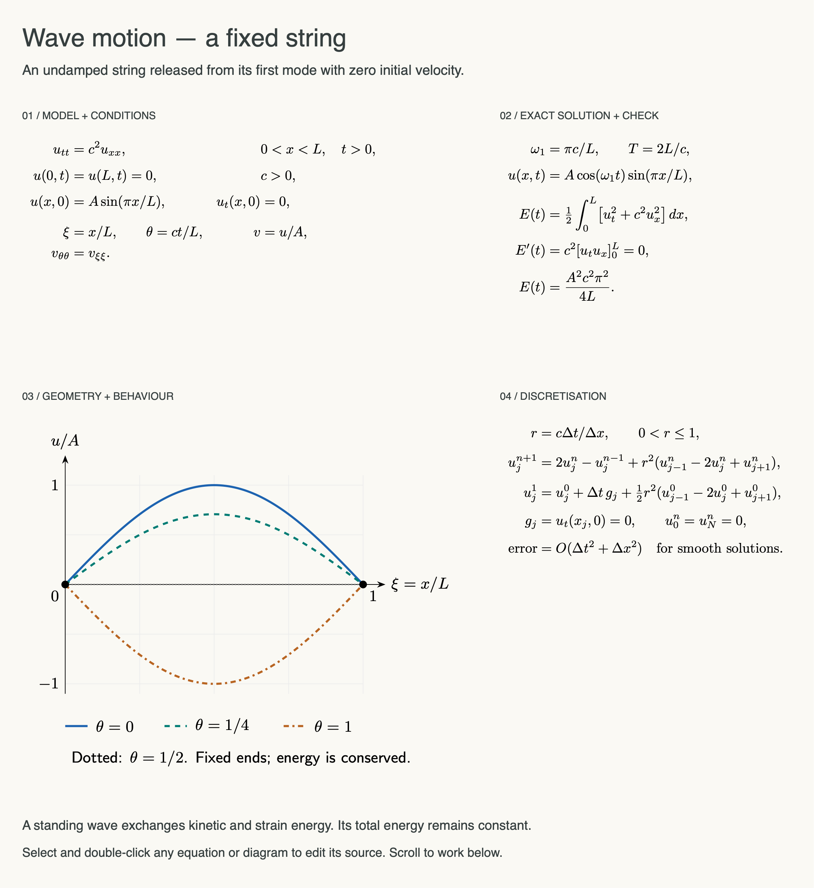
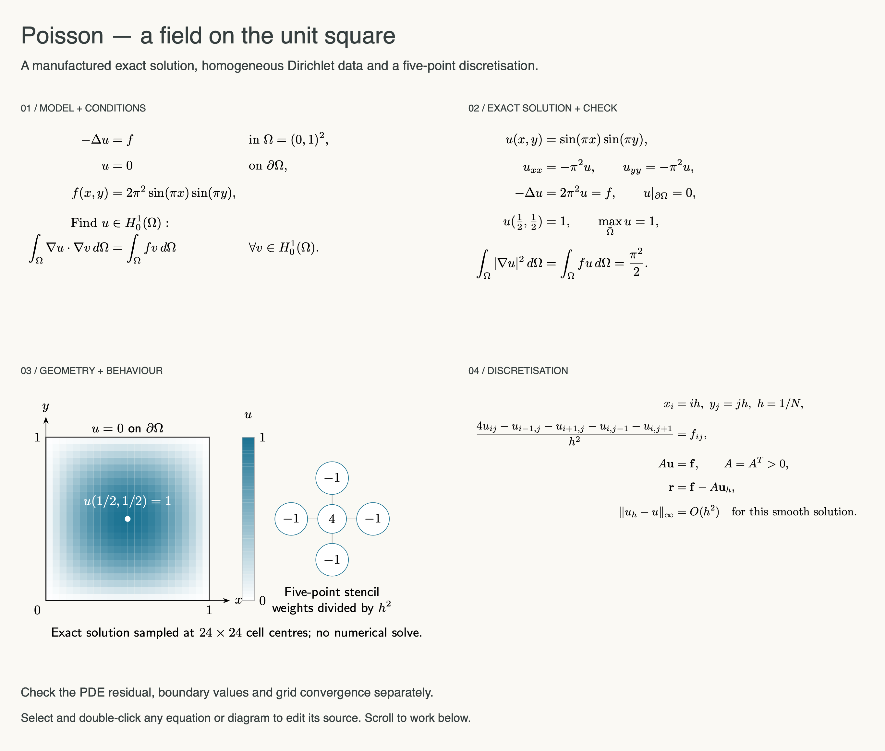

# Worked PDE models

The academic examples now use detailed partial differential equations, with typeset mathematics and original TikZ diagrams. The app ships the rendered PNG/PDF assets and their source, so all six demo boards open without installing TeX. Editing and rendering new source still needs local TeX.

| Model | Conditions and solution | Diagram and numerical method |
| --- | --- | --- |
| Heat diffusion | Uniform rod; zero Dirichlet ends; first and third sine modes in the initial data; exact exponential modal decay and the L2 energy identity | Three exact profiles at dimensionless times 0, 0.04 and 0.12; forward-Euler centred-space scheme and its stability restriction |
| Fixed string | Undamped wave equation; fixed ends; first-mode displacement and zero initial velocity; standing-wave solution and conserved energy | Signed displacement profiles at four phases; centred time/space update, special first step and CFL restriction |
| Poisson field | Unit square; zero Dirichlet boundary; a manufactured sine-product solution; strong and weak forms, maximum and energy check | Exact field sampled on a 24 × 24 display grid, labelled colour scale and five-point stencil; linear system and residual |

These are worked mathematical examples, not an interactive PDE solver. Curves come from the stated closed-form solutions. The Poisson field shows cell-centre samples of the exact solution, not output from solving a finite-difference system. Colours and line styles distinguish the time profiles; diagram labels use dimensionless coordinates where appropriate.

## Heat diffusion

Assume length L > 0, constant diffusivity κ > 0 and amplitude U₀ > 0. The field is temperature relative to the fixed endpoint temperature. Diffusivity has units of length squared per time. With ξ = x/L and τ = κt/L², both plotted coordinates are dimensionless. The plotted third-mode coefficient is 0.35; its decay exponent is nine times the first mode's. E is an L2 energy functional, not the total thermodynamic heat content.


[Vector PDF](demos/pde-heat.pdf) · [Equation source](../Sources/WhiteboardCore/Resources/PDE/heat-model.tex) · [TikZ source](../Sources/WhiteboardCore/Resources/PDE/heat-diagram.tex)

## Wave motion

Assume L, c and A are positive. The model is a uniform, undamped string with small transverse displacement, fixed endpoints and zero initial velocity. Time is plotted as θ = ct/L. The dotted profile is at θ = 1/2, where displacement is zero but velocity is not: energy has not disappeared. The conserved functional is the usual wave energy scaled by the constant mass-density factor.



[Vector PDF](demos/pde-wave.pdf) · [Equation source](../Sources/WhiteboardCore/Resources/PDE/wave-model.tex) · [TikZ source](../Sources/WhiteboardCore/Resources/PDE/wave-diagram.tex)

## Poisson problem

Coordinates are nondimensionalised on the unit square. The source is chosen to match u = sin(πx) sin(πy), allowing boundary values, residuals and grid refinement to be checked against a known answer. The weak form uses H₀¹ test functions; the five-point matrix refers to interior unknowns with homogeneous Dirichlet boundary values removed. Its positive definiteness supports standard elliptic solvers; the app itself does not run one.



[Vector PDF](demos/pde-poisson.pdf) · [Equation source](../Sources/WhiteboardCore/Resources/PDE/poisson-model.tex) · [TikZ source](../Sources/WhiteboardCore/Resources/PDE/poisson-diagram.tex)

## Verification and source material

The example data and diagrams are original. The mathematical methods follow standard Fourier separation for diffusion, wave-energy arguments and centred finite differences. Supporting primary teaching material: [MIT Fourier series and the heat equation](https://math.mit.edu/~gs/cse/websections/cse41.pdf), [MIT Waves and Imaging notes](https://math.mit.edu/icg/resources/teaching/18.367/notes367.pdf), and [MIT numerical PDE course materials](https://math.mit.edu/classes/18.336/index.html).

`python3 scripts/check_pde_models.py` independently checks sampled PDE residuals, boundary and initial data, the heat and wave energy identities, and second-order convergence of the Poisson stencil residual using Python's standard library. These are numerical consistency checks of the displayed formulas, not a symbolic proof or a LaTeX parser. All twelve equation/diagram fragments were compiled with the real local TeX engine, and the full board exports were visually inspected.

To regenerate the bundled rendered assets after editing the source files:

```sh
swift run WhiteboardPDEAssets Sources/WhiteboardCore/Resources/PDE
bash scripts/build.sh
```

This developer step needs local TeX and runs only when explicitly requested. Ordinary demo entry copies saved assets; it does not execute their source. Existing demo libraries receive the three PDE boards once. Existing ideas and annotations are retained, and later renaming a PDE board does not cause it to be recreated on every visit.
